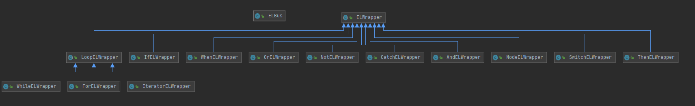

## EL表达式流式装配模块

[toc]

### 实现功能

1. 用户可以通过`ELBus`入口类动态创建EL表达式，调用方法和目前官网文档的组件调用方法保持一致，EL表达式输出结果与调用方法保持一致。比如，`if组件`的`if(a,b,c)`、`if(a,b).else(c)`、`if(a,b).elif(c,d)` 输出的EL表达式与组装时调用的方法相同。
2. 支持以树形结构格式化输出EL表达式，只需要修改调用参数`toEL(true)`。
3. 支持灵活的调用方式。比如，`then`组件的参数允许任意个数的`String`和`ELWrapper`变量，避免重复定义单节点组件。
4. 组装表达式时对参数进行校验。包括是否为单节点组件、是否允许为与或非表达式等。减少表达式实际执行时出错的可能性。

PS：最终输出的EL表达式中，为避免用户定义的组件名和LiteFlow的命名规范起冲突，使用`node`关键字对用户的组件名进行包装。

### 类图

EL表达式流式装配模块中各个类之间的依赖关系如下图：



以ELBus作为入口类提供表达式调用的静态方法，ELWrapper为抽象父类，定义了各个表达式共有的变量：`表达式的子节点列表 elWrapperList`、 `switch表达式需要使用的tag`、 `switch表达式需要使用的id`，以及共有发方法，其余表达式，包括表示单个节点的`NodeELWrapper`均为`ELWrapper`的子类。

### 示例

在TestMain类中列举了很多样例，官网中的两个示例组装和输出结果如下：

```Java
// 文档中复杂编排的例子
/* 复杂编排例子一
        THEN(
            A,
            WHEN(
                THEN(B, C),
                THEN(D, E, F),
                THEN(
                    SWITCH(G).to(
                        THEN(H, I, WHEN(J, K)).id("t1"),
                        THEN(L, M).id("t2")
                    ),
                    N
                )
            ),
            Z
        );
*/
el = ELBus.then(
    "a",
    ELBus.when(
        ELBus.then("b", "c"),
        ELBus.then("d", "e").then("f"),
        ELBus.then(
            ELBus.switchOpt("g").to(
                ELBus.then("h", "i",
                           ELBus.when("j", "k")).id("t1"),
                ELBus.then("l", "m").id("t2")
            ),
            ELBus.then("n")
        )
    ),
    "z"
).toEL(true);
System.out.println(el);
/* 
非格式化输出：
THEN(node("a"), WHEN(THEN(node("b"), node("c")), THEN(node("d"), node("e"), node("f")), THEN(SWITCH(node("g")).TO(THEN(node("h"), node("i"), WHEN(node("j"), node("k"))).id("t1"), THEN(node("l"), node("m")).id("t2")), THEN(node("n")))), node("z"))

格式化输出：
THEN(
	node("a"),
	WHEN(
		THEN(
			node("b"),
			node("c")
		),
		THEN(
			node("d"),
			node("e"),
			node("f")
		),
		THEN(
			SWITCH(node("g")).TO(
				THEN(
					node("h"),
					node("i"),
					WHEN(
						node("j"),
						node("k")
					)
				).id("t1"),
				THEN(
					node("l"),
					node("m")
				).id("t2")
			),
			THEN(
				node("n")
			)
		)
	),
	node("z")
)
*/

/* 复杂编排例子二
        THEN(
            A,
            SWITCH(B).to(
                THEN(D, E, F).id("t1"),
                THEN(
                    C,
                    WHEN(
                        THEN(
                            SWITCH(G).to(THEN(H, I).id("t2"), J),
                            K
                        ),
                        THEN(L, M)
                    )
                ).id("t3")
            ),
            Z
        );
*/
el = ELBus.then(
    "a",
    ELBus.switchOpt("b").to(
        ELBus.then("d", "e", "f").id("t1"),
        ELBus.then(
            "c",
            ELBus.when(
                ELBus.then(
                    ELBus.switchOpt("g").to(
                        ELBus.then("h", "i").id("t2"),
                        "j"
                    ),
                    "k"
                ),
                ELBus.then("l", "m")
            )
        ).id("t3")
    ),
    "z"
).toEL(true);
System.out.println(el);
/* 
非格式化输出：
THEN(node("a"), SWITCH(node("b")).TO(THEN(node("d"), node("e"), node("f")).id("t1"), THEN(node("c"), WHEN(THEN(SWITCH(node("g")).TO(THEN(node("h"), node("i")).id("t2"), node("j")), node("k")), THEN(node("l"), node("m")))).id("t3")), node("z"))

格式化输出：
THEN(
	node("a"),
	SWITCH(node("b")).TO(
		THEN(
			node("d"),
			node("e"),
			node("f")
		).id("t1"),
		THEN(
			node("c"),
			WHEN(
				THEN(
					SWITCH(node("g")).TO(
						THEN(
							node("h"),
							node("i")
						).id("t2"),
						node("j")
					),
					node("k")
				),
				THEN(
					node("l"),
					node("m")
				)
			)
		).id("t3")
	),
	node("z")
)

*/
```

